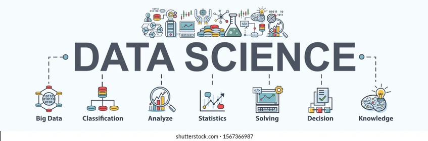

---

## 👋 Hi! I'm David Villanueva

I'm a Data Scientist, with a strong foundation in finance, advanced analytics, and machine learning. 

I'm passionate about solving real-world problems using data, modeling, and impactful storytelling.

---

##  Featured Projects

| Project | Objective | Technologies |
|---------|-------------|--------------|
| [ Movie Review Sentiment Analysis](https://github.com/lolapaul/movie-review-sentiment-analysis) | Build a binary classification model to automatically detect negative film reviews using labeled data from IMDB. Explore different modeling techniques and analyze their ability to generalize to unseen reviews. | NLP, TF-IDF, scikit-learn |
| [ Age Detection via Computer Vision](https://github.com/lolapaul/age-estimation-cnn) | Develop a deep learning model that estimates a person's age from their photograph to determine if they are legally eligible to purchase alcohol. | TensorFlow, Keras, ResNet50 |
| [ Customer Churn Prediction](https://github.com/lolapaul/customer-churn-prediction) | This project builds a machine learning model to predict customer churn for Interconnect, a telecom provider. The company wants to proactively identify customers likely to leave and offer them retention incentives. | pandas, scikit-learn, xgboost |
| [ Used Car Price Prediction](https://github.com/lolapaul/used-car-price-prediction) | Machine learning project to predict the market price of used cars. | LightGBM, Random Forest, pandas |
| [ Instacart Behavior Analysis](https://github.com/lolapaul/instacart-customer-behavior-analysis) | Exploratory data analysis of a modified Instacart dataset to uncover customer behavior and shopping habits. | pandas, matplotlib, seaborn |
| [ Chicago Taxi & Weather Analysis](https://github.com/lolapaul/chicago-taxi-analysis) | Combined SQL and Python to assess the impact of weather on taxi ride durations. | SQL, pandas, seaborn |

---

##  Want to explore all my projects?

 [See all my repositories here](https://github.com/lolapaul?tab=repositories)

---

##  Connect with me

- [LinkedIn](https://www.linkedin.com/in/david-villanueva-59659727)
- [GitHub](https://github.com/lolapaul)

<!--
**lolapaul/lolapaul** is a ✨ _special_ ✨ repository because its `README.md` (this file) appears on your GitHub profile.

Here are some ideas to get you started:

- 🔭 I’m currently working on ...
- 🌱 I’m currently learning ...
- 👯 I’m looking to collaborate on ...
- 🤔 I’m looking for help with ...
- 💬 Ask me about ...
- 📫 How to reach me: ...
- 😄 Pronouns: ...
- ⚡ Fun fact: ...
-->
